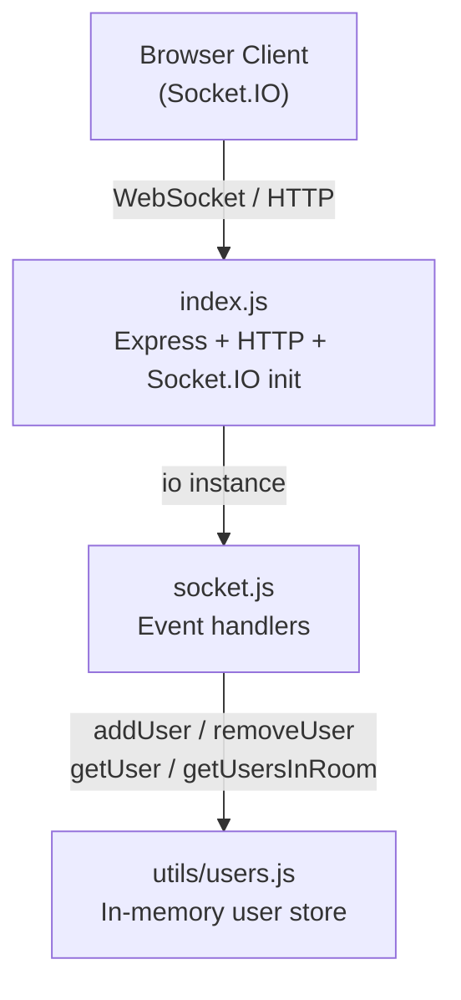
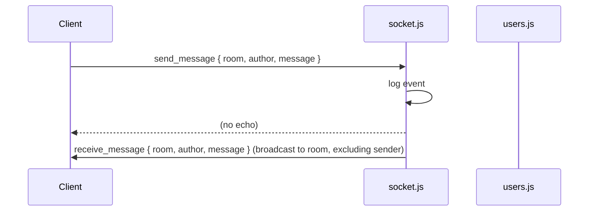
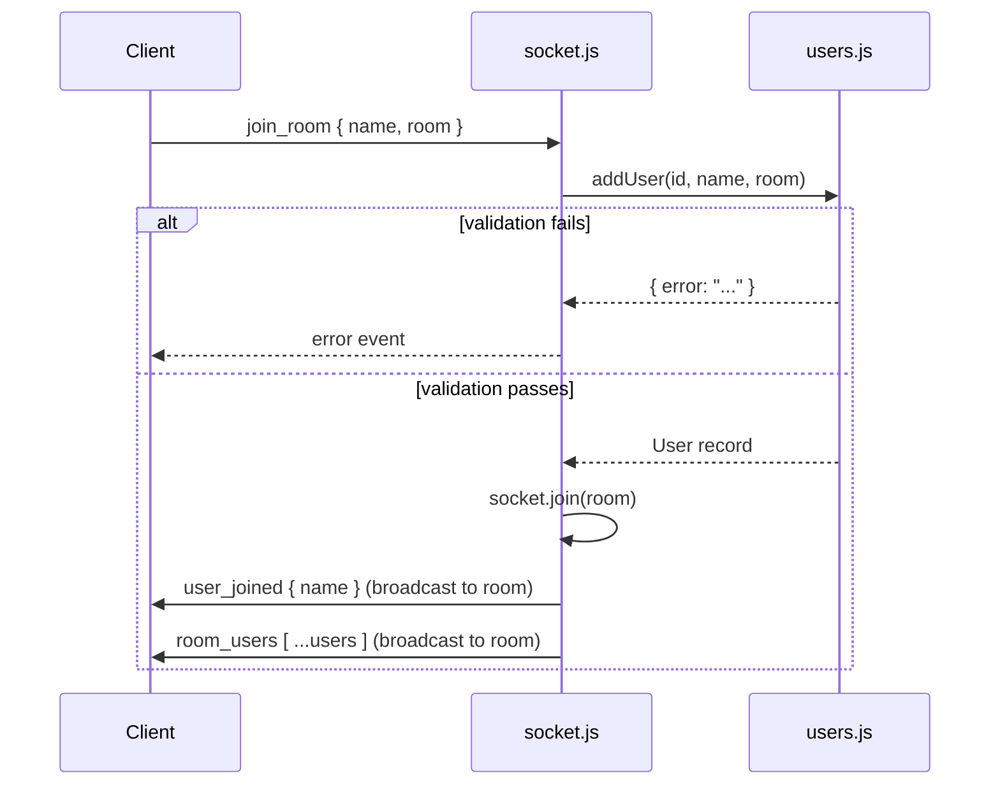

# Design Document: Anonet Backend

## Overview

Anonet is a lightweight real-time chat backend that also relays WebRTC signaling for peer-to-peer file transfer. It is built on Node.js with Express.js for the HTTP layer and Socket.IO for persistent WebSocket connections. All state is held in-memory — there is no database, no authentication, and no file storage.

The server exposes a single Socket.IO namespace on which clients connect, join named rooms, exchange chat messages, and negotiate WebRTC sessions. The design is intentionally minimal: three files, four exported functions, and a handful of Socket.IO event handlers.

### Key Design Goals

- **Simplicity**: No external dependencies beyond Express and Socket.IO. No persistence layer.
- **Room isolation**: Messages and signaling payloads are scoped to a named room; the server never broadcasts globally.
- **Transparency for WebRTC**: The server relays offer/answer/ICE payloads without inspecting or storing them.
- **Predictable module boundaries**: `index.js` owns startup, `socket.js` owns event handling, `utils/users.js` owns the user store.

---

## Architecture

The system is a single Node.js process. The three modules form a strict dependency hierarchy:

```
index.js
  └── socket.js  (receives io instance)
        └── utils/users.js  (pure in-memory store)
```



**Request flow for a typical chat message:**



**Room join flow:**



---

## Components and Interfaces

### `server/index.js`

Responsibilities:
- Create the Express app and attach it to a `node:http` server.
- Attach a Socket.IO instance with CORS configured for `http://localhost:5173`.
- Import and invoke the socket handler, passing the `io` instance.
- Call `server.listen(PORT)` and log the port.

No logic beyond initialisation lives here.

```js
// Pseudocode
const app = express();
const server = http.createServer(app);
const io = new Server(server, { cors: { origin: "http://localhost:5173" } });
app.use(cors({ origin: "http://localhost:5173" }));
setupSocket(io);          // from socket.js
server.listen(PORT, () => console.log(`Listening on port ${PORT}`));
```

---

### `server/socket.js`

Exported as a single function `setupSocket(io)`.

Registers the following Socket.IO event handlers on each new connection:

| Event received      | Action                                                                                  | Events emitted                                      |
|---------------------|-----------------------------------------------------------------------------------------|-----------------------------------------------------|
| `join_room`         | Validate nickname → `addUser` → `socket.join(room)`                                    | `error` (on failure), `user_joined`, `room_users`   |
| `send_message`      | Broadcast to room, excluding sender                                                     | `receive_message` (to room, excluding sender)       |
| `webrtc_offer`      | Relay to room, excluding sender                                                         | `webrtc_offer` (to room, excluding sender)          |
| `webrtc_answer`     | Relay to room, excluding sender                                                         | `webrtc_answer` (to room, excluding sender)         |
| `ice_candidate`     | Relay to room, excluding sender                                                         | `ice_candidate` (to room, excluding sender)         |
| `disconnect`        | `removeUser` → notify room                                                              | `user_left`, `room_users`                           |

All handlers log their event details to the console.

The "excluding sender" pattern is implemented with `socket.to(room).emit(...)`, which is Socket.IO's built-in mechanism for broadcasting to a room without echoing to the originating socket.

---

### `server/utils/users.js`

A pure in-memory module. Maintains a module-level `users` array. Exports four functions:

| Function                        | Signature                                      | Returns                          |
|---------------------------------|------------------------------------------------|----------------------------------|
| `addUser`                       | `(id, name, room) → User \| { error }`        | Created `User` or error object   |
| `removeUser`                    | `(id) → User \| undefined`                    | Removed `User` or `undefined`    |
| `getUser`                       | `(id) → User \| undefined`                    | Matching `User` or `undefined`   |
| `getUsersInRoom`                | `(room) → User[]`                             | Array of `User` records          |

Nickname validation is performed inside `addUser` before the record is inserted.

---

## Data Models

### User Record

```js
{
  id:   string,   // socket.id — unique per connection
  name: string,   // validated nickname (1–24 chars, [a-zA-Z0-9_])
  room: string    // room name the user joined
}
```

### Socket.IO Event Payloads

**Inbound (client → server)**

```js
// join_room
{ name: string, room: string }

// send_message
{ room: string, author: string, message: string }

// webrtc_offer
{ room: string, offer: RTCSessionDescriptionInit, fileMeta: { name: string, size: number } }

// webrtc_answer
{ room: string, answer: RTCSessionDescriptionInit }

// ice_candidate
{ room: string, candidate: RTCIceCandidateInit }
```

**Outbound (server → client)**

```js
// error
string  // validation error message

// user_joined
{ name: string }

// user_left
{ name: string }

// room_users
User[]  // current snapshot of users in the room

// receive_message
{ room: string, author: string, message: string }

// webrtc_offer  (relayed, sender excluded)
{ offer: RTCSessionDescriptionInit, fileMeta: { name: string, size: number } }

// webrtc_answer  (relayed, sender excluded)
{ answer: RTCSessionDescriptionInit }

// ice_candidate  (relayed, sender excluded)
{ candidate: RTCIceCandidateInit }
```

### Validation Rules

| Field      | Rule                                                        | Error message (example)                              |
|------------|-------------------------------------------------------------|------------------------------------------------------|
| `name`     | Length ≤ 24 characters                                      | `"Nickname must be 24 characters or fewer."`         |
| `name`     | Matches `/^[a-zA-Z0-9_]+$/`                                 | `"Nickname may only contain letters, numbers, and underscores."` |


---

## Correctness Properties

*A property is a characteristic or behavior that should hold true across all valid executions of a system — essentially, a formal statement about what the system should do. Properties serve as the bridge between human-readable specifications and machine-verifiable correctness guarantees.*

### Property 1: addUser round-trip — record structure and retrievability

*For any* valid socket ID, nickname, and room name, calling `addUser(id, name, room)` should return a User record containing exactly those three values, and a subsequent `getUser(id)` call should return the same record.

**Validates: Requirements 2.1, 2.2**

---

### Property 2: removeUser round-trip

*For any* user that has been added to the store, calling `removeUser(id)` should return the User record that was added, and a subsequent `getUser(id)` call should return `undefined`.

**Validates: Requirements 2.3**

---

### Property 3: getUsersInRoom filter correctness

*For any* collection of users distributed across one or more rooms, `getUsersInRoom(room)` should return exactly the users whose `room` field matches the given room name — no users from other rooms, and no users omitted from the target room.

**Validates: Requirements 2.5**

---

### Property 4: Nickname length validation

*For any* string whose length exceeds 24 characters, `addUser` should return an error object (not a User record), and the user store should remain unchanged.

**Validates: Requirements 3.1**

---

### Property 5: Nickname character validation

*For any* string that contains at least one character outside the set `[a-zA-Z0-9_]`, `addUser` should return an error object (not a User record), and the user store should remain unchanged.

**Validates: Requirements 3.2**

---

### Property 6: room_users snapshot after join is complete

*For any* room and any set of users who have joined that room, the `room_users` payload broadcast after the most recent join should contain every user currently in the room, including the user who just joined.

**Validates: Requirements 4.4**

---

### Property 7: send_message relay — payload fidelity and no echo

*For any* `{ room, author, message }` payload emitted as `send_message`, the `receive_message` event broadcast to the room should carry the identical payload, and the originating socket should not receive the `receive_message` event.

**Validates: Requirements 5.1, 5.2**

---

### Property 8: room_users snapshot after disconnect excludes removed user

*For any* room with one or more users, after a user disconnects, the `room_users` payload broadcast to the remaining sockets should not contain the disconnected user.

**Validates: Requirements 6.3**

---

### Property 9: webrtc_offer relay — payload fidelity and no echo

*For any* `{ offer, fileMeta }` payload emitted as `webrtc_offer`, the relayed `webrtc_offer` event broadcast to the room should carry the identical `offer` and `fileMeta` values (no inspection or modification), and the originating socket should not receive the event.

**Validates: Requirements 7.1, 7.2, 7.3**

---

### Property 10: webrtc_answer relay — payload fidelity and no echo

*For any* `{ answer }` payload emitted as `webrtc_answer`, the relayed `webrtc_answer` event broadcast to the room should carry the identical `answer` value, and the originating socket should not receive the event.

**Validates: Requirements 8.1, 8.2, 8.3**

---

### Property 11: ice_candidate relay — payload fidelity and no echo

*For any* `{ candidate }` payload emitted as `ice_candidate`, the relayed `ice_candidate` event broadcast to the room should carry the identical `candidate` value, and the originating socket should not receive the event.

**Validates: Requirements 9.1, 9.2, 9.3**

---

## Error Handling

### Nickname validation errors

`addUser` returns `{ error: string }` when validation fails. The Socket_Handler checks for the presence of an `error` key on the return value and, if found, emits an `error` event to the originating socket with the message string. No user is added to the store and no room join occurs.

```js
const result = addUser(socket.id, name, room);
if (result.error) {
  socket.emit('error', result.error);
  return;
}
socket.join(room);
// ... broadcast user_joined and room_users
```

### Disconnect with no matching user

`removeUser` returns `undefined` when the socket ID is not in the store (e.g., the socket disconnected before completing `join_room`). The Socket_Handler guards against this:

```js
const user = removeUser(socket.id);
if (!user) return;  // nothing to broadcast
// ... broadcast user_left and room_users
```

### Unhandled errors

No try/catch is required for the in-memory operations — they are synchronous and cannot throw under normal conditions. Socket.IO's own error handling covers transport-level failures.

---

## Testing Strategy

### Overview

The testing approach uses two complementary layers:

1. **Unit tests** — verify specific examples, edge cases, and the Socket_Handler's event wiring using mocks.
2. **Property-based tests** — verify universal invariants across a wide range of generated inputs.

Both layers are necessary: unit tests catch concrete bugs in specific scenarios; property tests verify that invariants hold across the full input space.

### Test Framework

- **Test runner**: [Jest](https://jestjs.io/) (standard for Node.js projects)
- **Property-based testing library**: [fast-check](https://fast-check.dev/) — mature, well-maintained, integrates cleanly with Jest
- **Minimum iterations per property test**: 100 (fast-check default is 100 runs)

### Module Under Test: `utils/users.js`

This module is a pure in-memory store with no I/O, making it ideal for both unit and property-based testing.

**Unit tests:**
- `getUser` returns `undefined` for an unknown ID (edge case from Requirement 2.4)
- `addUser` returns an error for an empty nickname
- `addUser` returns an error for a nickname of exactly 25 characters (boundary)
- `addUser` accepts a nickname of exactly 24 characters (boundary)
- `removeUser` returns `undefined` for an unknown ID

**Property-based tests** (using fast-check):

Each property test is tagged with a comment referencing the design property it validates.

```
// Feature: anonet-backend, Property 1: addUser round-trip — record structure and retrievability
// Feature: anonet-backend, Property 2: removeUser round-trip
// Feature: anonet-backend, Property 3: getUsersInRoom filter correctness
// Feature: anonet-backend, Property 4: Nickname length validation
// Feature: anonet-backend, Property 5: Nickname character validation
```

Generators needed:
- Valid nickname: `fc.stringMatching(/^[a-zA-Z0-9_]{1,24}$/)` 
- Invalid nickname (too long): `fc.string({ minLength: 25 })`
- Invalid nickname (bad chars): strings containing at least one character outside `[a-zA-Z0-9_]`
- Socket ID: `fc.string({ minLength: 1 })`
- Room name: `fc.string({ minLength: 1 })`

### Module Under Test: `socket.js`

Socket.IO event handlers are tested with mocked `socket` and `io` objects. The `users.js` module is imported directly (not mocked) so that handler + store integration is tested together.

**Unit tests:**
- `join_room` with invalid nickname → `socket.emit('error', ...)` called, `socket.join` not called
- `join_room` with valid nickname → `socket.join(room)` called, `user_joined` and `room_users` broadcast
- `send_message` → `socket.to(room).emit('receive_message', payload)` called
- `disconnect` with no matching user → no broadcast emitted
- `disconnect` with matching user → `user_left` and `room_users` broadcast

**Property-based tests:**

```
// Feature: anonet-backend, Property 6: room_users snapshot after join is complete
// Feature: anonet-backend, Property 7: send_message relay — payload fidelity and no echo
// Feature: anonet-backend, Property 8: room_users snapshot after disconnect excludes removed user
// Feature: anonet-backend, Property 9: webrtc_offer relay — payload fidelity and no echo
// Feature: anonet-backend, Property 10: webrtc_answer relay — payload fidelity and no echo
// Feature: anonet-backend, Property 11: ice_candidate relay — payload fidelity and no echo
```

For Properties 7, 9, 10, 11 the "no echo" assertion is verified by checking that the mock `socket.emit` is never called with the relayed event name, while `socket.to(room).emit` is called with the correct payload.

### Smoke Tests

A small set of smoke tests verify the server wires up correctly:

- Server starts and accepts HTTP connections on the configured port
- Socket.IO client can connect successfully
- CORS headers are present for `http://localhost:5173`
- `utils/users.js` exports `addUser`, `removeUser`, `getUser`, `getUsersInRoom`
- `socket.js` exports a function

These run once and do not use property-based testing.
